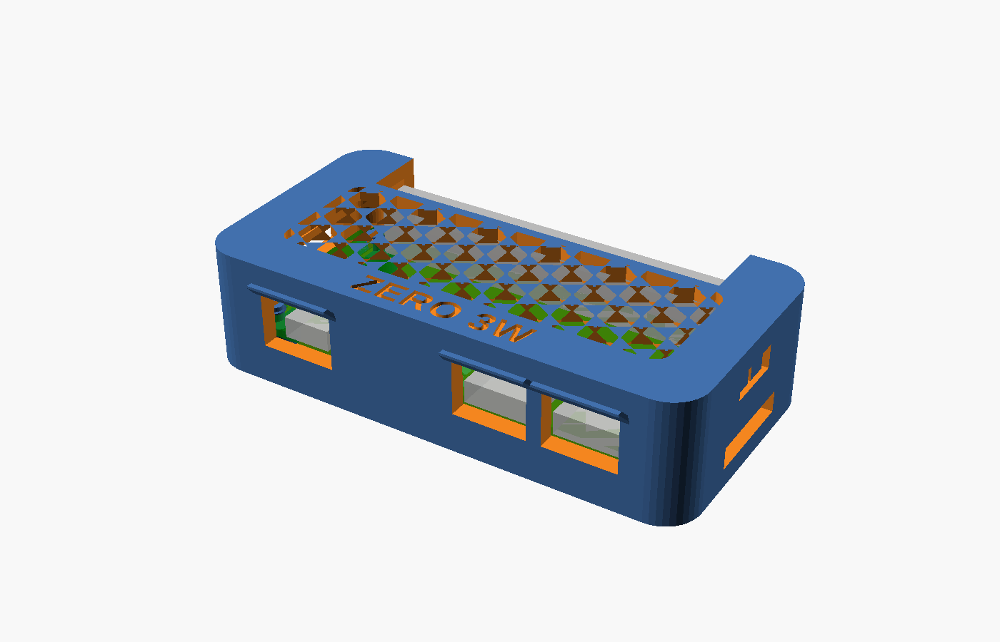
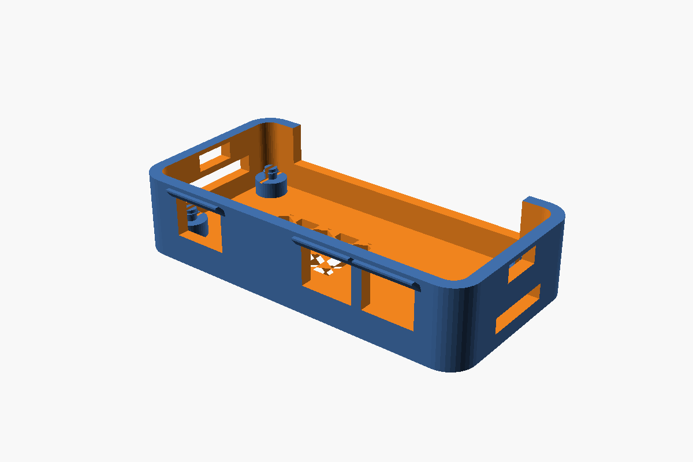
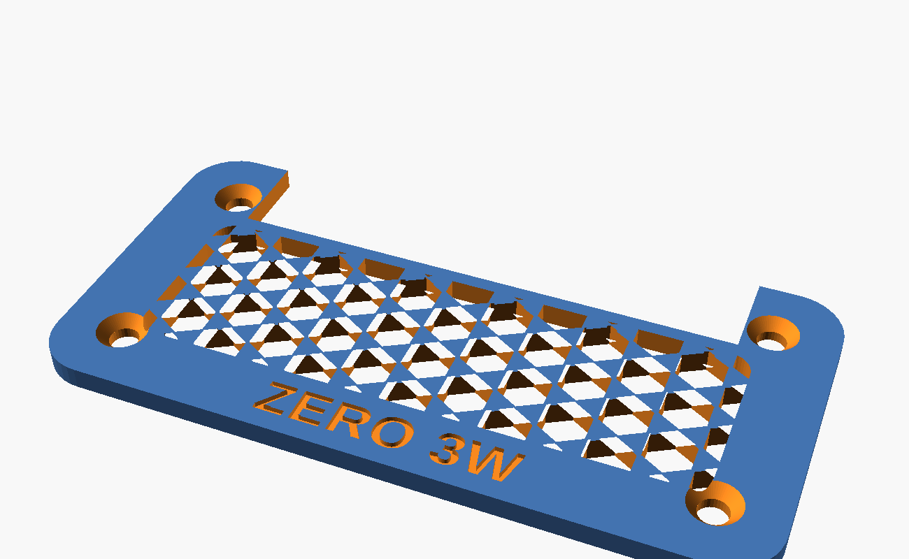
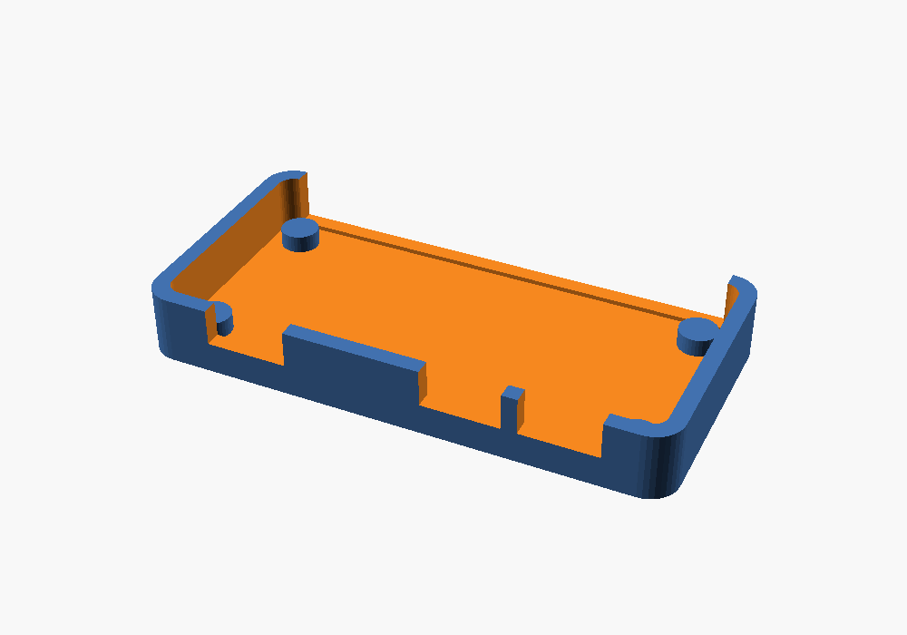

# START HERE — Ender 3 V3 SE prints

Printer arrives tomorrow. This folder is the pile.

**On your machine, this lives on branch `cursor/radxa-zero-3w-case-fe04`, not `main`.** Sync with:

```bash
cd /path/to/Atom-Code
git fetch origin
git checkout cursor/radxa-zero-3w-case-fe04
git pull origin cursor/radxa-zero-3w-case-fe04
```

Then open `PRINTS/START-HERE.md`.

**Hive** is two parts: base + lid. The board clicks onto four split pins in the base. The lid snaps on at the short ends. No screws.

## Tomorrow, in this order

1. **Fit coupon first** (~15 min, little filament)  
   `PRINTS/stl/zero3w_coupon.stl`  
   Drop the real ZERO 3W in. Try **micro HDMI** (left), USB 3.0 Host, and USB 2.0 OTG (**power**).  
   The left hole is sized for the **cable’s plastic housing**, not just the 6.5 mm metal. Typical Type-D overmolds are ~11 mm wide, so that opening will look close to the USB-C holes. That is required for the plug to seat.  
   If the plugs line up, print Hive. If they don’t, stop — don’t print the full case.

2. **Hive case**  
   `PRINTS/stl/zero3w_hive-base.stl`  
   `PRINTS/stl/zero3w_hive-lid.stl`  
   Board onto the four pins — they are **split pins with a detent**, so the board clicks on and stays. Lid snaps — **one clip on each short end**. To open, press the barb in through the window on the outside of each end, then lift.

One-plate file: `PRINTS/stl/zero3w_hive-print.stl`.

## Slice (Ender 3 V3 SE, 0.4 mm nozzle)

| | Coupon | Hive base / lid |
|---|---|---|
| Material | PLA is fine | PETG preferred (snaps + heat) |
| Layer | 0.20 mm | 0.20 mm |
| Walls | 3 | 3 |
| Infill | 15% | 20% gyroid |
| Supports | None | None |
| Orientation | as exported | as exported |

Do not print until the slicer layer view looks right.

## Source

| File | What it is |
|---|---|
| `zero3w_board.scad` | Official v1.11 DXF coordinates. Shared by coupon + Hive. |
| `zero3w_coupon.scad` | Open tray. First print. |
| `zero3w_hive.scad` | Lattice lid, end snaps, visors, locating pins. `part` = `preview` / `base` / `lid` / `print`. |

```bash
cd PRINTS
openscad -D 'part="lid"' -o stl/zero3w_hive-lid.stl zero3w_hive.scad
```

## Previews









## The other case

Measured screw-together tray: [`cad/radxa-zero-3w-case/`](../cad/radxa-zero-3w-case/)
