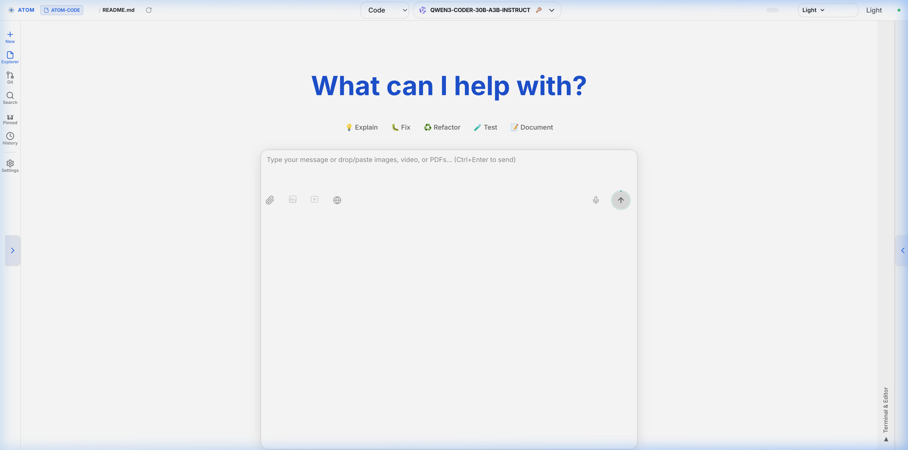
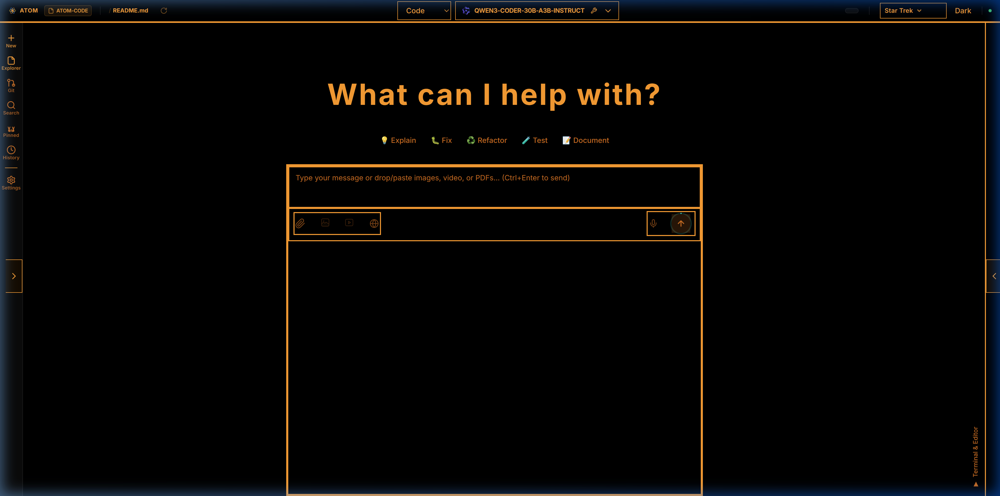

# ATOM Code

> ⚠️ **LINUX PROTOTYPE ONLY** — Developed and tested on Linux Mint. Windows and macOS are currently unsupported. Expect breakage on non-Linux systems.

A local-first AI coding assistant built with Svelte 5 and LM Studio. No cloud required, no subscriptions, no data leaving your machine.



## What It Does

- AI chat interface powered by local LLM models via LM Studio
- Automatic codebase indexing — the AI understands your entire project structure from the first message
- Signature-aware file injection — relevant files are automatically pulled into context based on your query
- Integrated file explorer with pinning and context management
- Integrated terminal
- Git panel with diff viewer and commit workflow
- Voice input via local Whisper model
- Web search integration via Brave Search
- Multiple themes including LCARS Star Trek, Ollama Forge, Perplexity, and default light/dark



## Requirements

- **Linux** (developed and tested on Linux Mint)
- Node.js 18+
- Python 3.10+ (for voice server)
- LM Studio with at least one model loaded
- NVIDIA GPU recommended (RTX 4070 or equivalent for best performance)
- `build-essential` package (for node-pty compilation)

## Quick Start

```bash
# Clone the repository
git clone https://github.com/MrBeeboh/Atom-Code.git
cd atom-code

# Install dependencies
npm install
cd services/file-server && npm install && cd ../..
cd services/terminal-server && npm install && cd ../..

# Voice server (optional)
cd voice-server && python3 -m venv venv && ./venv/bin/pip install -r requirements.txt && cd ..

# Start everything
./start-atom-code.sh
```

Open http://localhost:5173 in your browser.

## Stopping

```bash
./scripts/stop-atom-code.sh
```

Or press `Ctrl+C` in the terminal running `start-atom-code.sh`.

## Architecture

| Service | Port | Purpose |
|---|---|---|
| Vite Dev Server | 5173 | Main UI |
| LM Studio API | 1234 | Local LLM inference |
| File Server | 8768 | File tree and repo map indexing |
| Terminal Server | 8767 | Integrated terminal via WebSocket |
| Search Proxy | 5174 | Brave web search integration |
| Voice Server | 8765 | Whisper speech-to-text |

> 🔒 **Security:** All services bind to `127.0.0.1` (localhost) only. Never expose these ports publicly — the terminal server provides full shell access with no authentication. If you use a reverse proxy, only expose port 5173 and ensure the backend ports remain firewalled.

## How Codebase Indexing Works

When you open a workspace, ATOM Code automatically:
1. Indexes the directory structure and extracts function/class signatures from all source files
2. Injects a compressed repo map into the AI system prompt
3. Detects which files are relevant to your query using signature-aware matching
4. Auto-injects those files into context — no manual file attachment needed

## Watchdog

A background watchdog process monitors all six services every 30 seconds and automatically restarts any that stop responding. Restart events are logged to `watchdog.log`.

## Demo

A recorded demo of ATOM Code in action is available at [`docs/media/demo.webp`](docs/media/demo.webp) — shows theme switching, chat interaction, file explorer, and integrated terminal.

## Project Structure

```
atom-code/
├── src/                    # Svelte 5 frontend
│   └── lib/
│       ├── components/     # UI components
│       └── stores.js       # Svelte stores
├── services/
│   ├── file-server/        # File tree and repo map API
│   └── terminal-server/    # Terminal backend (WebSocket + HTTP)
├── voice-server/           # Whisper voice input server
├── scripts/                # Start, stop, watchdog, and search proxy
├── docs/                   # Documentation and media
└── public/                 # Static assets
```

## License

[MIT](LICENSE)
