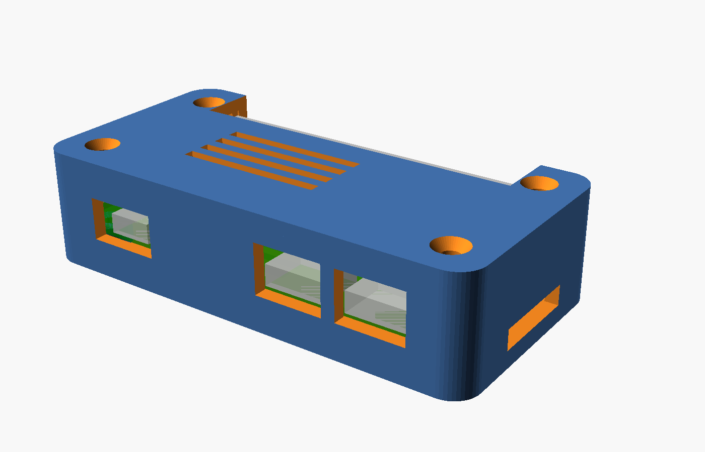
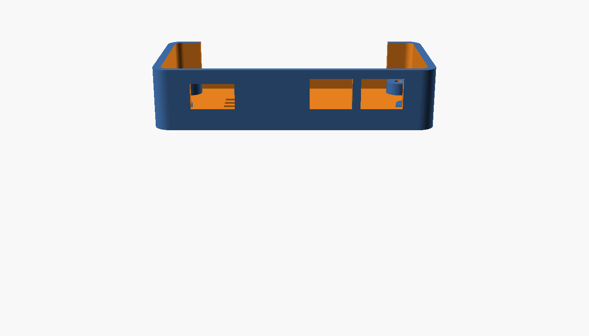
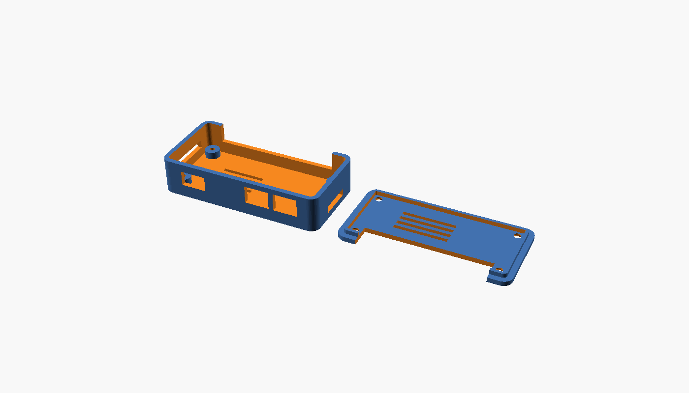

# Radxa ZERO 3W printable enclosure

Measured screw-together tray for a **Radxa ZERO 3W**. For the Hive case (hex lattice, snap lid, locating pins) and the “printer arrives tomorrow” checklist, start at **[`PRINTS/START-HERE.md`](../../PRINTS/START-HERE.md)**.

This is not a Raspberry Pi Zero case with the ports renamed. Connector positions come from Radxa’s official ZERO 3W v1.11 2D DXF ([`radxa_zero_3w_2d_dxf.zip`](https://dl.radxa.com/zero3/docs/hw/3w/radxa_zero_3w_2d_dxf.zip)).

## Preview

Assembled (dummy board in green). Three openings on the port edge: micro HDMI, USB 3.0 Host, USB 2.0 OTG (power). GPIO slot along the back. microSD on the short wall.



Base tray, port wall: HDMI (left), then USB 3.0 and OTG with a printed divider between them.



Print plate (base floor-down, lid outer-face-down). No supports.



## What you get

| File | What to do with it |
|---|---|
| `zero3w_case.scad` | Source. Change parameters here, then F5 / F6 in OpenSCAD. |
| `stl/zero3w_case-base.stl` | Bottom tray. Load in the slicer. |
| `stl/zero3w_case-lid.stl` | Top cover. Load in the slicer. |
| `stl/zero3w_case-print.stl` | Base + lid on one plate if you prefer a single slice. |

## Review before you print

Do this in order. Do not print until the slice looks right.

1. **Open the `.scad` in [OpenSCAD](https://openscad.org/)**  
   Set `part` to `preview` (Customizer or the line at the top). Press **F5**. You should see the dummy board, two USB-C shells and HDMI on the long port edge, GPIO along the opposite long edge, CSI on the short HDMI-end wall, microSD on the other short wall.

2. **Check numbers against your board**  
   Caliper the real ZERO 3W if you can: overall 65 × 30 mm, USB-C and HDMI centers, whether a 40-pin header is soldered. If a plug looks offset in preview, change the named dimensions at the top of the `.scad` and re-export.

3. **Slice the STL** in OrcaSlicer or Creality Print with an **Ender 3 V3 SE** profile.  
   - Both parts fit easily on the 220 mm bed.  
   - Print **base floor-down**, **lid outer-face-down** (the `print` STL already orients them).  
   - Scrub the layer view: port holes should be open, walls ≥ 2 mm, no floating islands.  
   - Supports: **none** with the default orientation.

4. **Test-fit before you crank screws**  
   Board drops onto the four standoffs. USB-C (power = OTG, data = USB 3.0) and micro HDMI should line up with the long-edge openings. microSD inserts from the short wall opposite CSI.

## Layout (board coordinates)

Origin is the PCB corner at the **HDMI / CSI** end. GPIO runs along y = 30 mm; ports along y = 0.

```
        CSI (FPC)                 u.FL
         |                          |
    y=30 |====== 40-pin GPIO =======|
         |                          |
         |         RK3566           |  TF / microSD (underside)
         |                          |
    y=0  | HDMI | MaskROM | USB3 | OTG |
         x=0                      x=65
```

| Feature | DXF-based position |
|---|---|
| PCB | 65.0 × 30.0 mm, 4 × Ø2.82 mm holes (M2.5) |
| Hole centers | (3.55, 3.60), (3.60, 26.45), (61.40, 3.60), (61.40, 26.50) |
| Micro HDMI | center x = 12.43 mm, port edge |
| USB 3.0 Host Type-C | center x = 41.49 mm, port edge |
| USB 2.0 OTG Type-C (power) | center x = 54.01 mm, port edge |
| MaskROM (bottom of PCB) | ≈ (21.8, 2.2) mm — paperclip hole in the floor |
| MIPI CSI | left short edge, center y ≈ 15 mm |
| microSD | right short edge, underside, center y ≈ 15 mm |

Power is the **OTG** USB-C, not the USB 3.0 port.

## Print settings (Ender 3 V3 SE, 0.4 mm nozzle)

| Setting | Value |
|---|---|
| Material | PETG preferred (Pi-class boards get warm). PLA is fine for a first fit check. |
| Layer height | 0.20 mm |
| Walls | 3 perimeters (2.0 mm design thickness) |
| Infill | 20–30% gyroid |
| Top/bottom | 5 layers |
| Supports | None |
| Bed | 220 × 220 mm — parts are about 72 × 37 mm each |

Hardware: **4 × M2.5 screws**, 8–12 mm long. Default standoffs are a 2.1 mm pilot for thread-forming into plastic. Set `heat_set_inserts = true` in the `.scad` if you use M2.5 heat-set inserts (3.6 mm bore).

## Parameters worth changing

All of these are at the top of `zero3w_case.scad`:

| Parameter | Default | When to change it |
|---|---|---|
| `gpio_h` | 8.8 | Lower to ~5.5 if your board has **no** 40-pin header and you want a flatter case. |
| `gpio_slot` | true | false if you want the GPIO sealed (headerless, or lid-off access only). |
| `port_clear` | 0.7 | Raise if USB-C / HDMI plugs scrape. Keep at or below ~1.2 mm or the two USB-C openings merge (the shells are only 3.5 mm apart). |
| `xy_clear` | 0.45 | Raise if the PCB will not drop in. |
| `csi_slot` / `sd_slot` | true | false to close those walls. |
| `ufl_hole` | false | true for an external antenna pigtail. |
| `heat_set_inserts` | false | true for brass inserts. |

Re-export STL after any change:

```bash
openscad -D 'part="base"'  -o stl/zero3w_case-base.stl  zero3w_case.scad
openscad -D 'part="lid"'   -o stl/zero3w_case-lid.stl   zero3w_case.scad
openscad -D 'part="print"' -o stl/zero3w_case-print.stl zero3w_case.scad
```

## Fit notes (read these)

- **Headered vs headerless SKUs.** Radxa sells both. Default height assumes a standard 8.5 mm female 40-pin header. The lid slot lets a ribbon sit on top of that header.
- **microSD is on the underside**, exiting the short wall by the OTG port — not where a Pi Zero SD card is.
- **MaskROM** is a pinhole in the floor, between HDMI and USB 3.0. You should not need it in normal use.
- **Cooling.** The lid is vented over the SoC. The RK3566 throttles under sustained load without airflow; this case is a cover, not a heatsink. A small heatsink on the SoC still fits under the default `gpio_h`.
- **First article.** FDM holes print undersize. If a USB-C plug does not enter, open `port_clear` by 0.2–0.3 mm and reprint the base only — do not force the connector.

## License

Case source in this folder is original to this repo. Board dimensions are from Radxa’s published hardware drawings; Radxa remains the vendor of the ZERO 3W.
